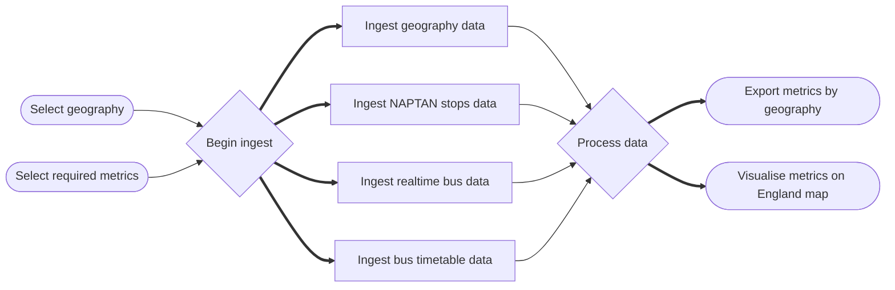

<!--- Badges start --->
 <a href="https://codecov.io/gh/datasciencecampus/bus-metrics-england" > </a>
<!--- Badges end --->


# bus-metrics-england

> :warning: This repository is still in the development phase. Caution should be taken before using or referencing this work in any way - use it at your own risk.

# Introduction
## About
This repo aims to provide other developers with tools to interrogate bus services in England by combining realtime (from the Bus Open Data Service) and timetable data (from Department for Transport). We aim to build flexibility for analysis at different geography levels and across a range of metrics, including service coverage, punctuality and quality of service (e.g. excess wait time).

## Installation
The project requires specific versions of some packages so it is recommended to set up a virtual environment, using both **venv** and **pip**:

```shell
python3.11 -m venv <name>
source <name>/bin/activate
conda deactivate

python -m pip install --upgrade pip
python -m pip install -r requirements.txt
```

You will also require a `.env` file in the format:

```shell
BODS_API_KEY="<api key for the BODS service>"
```

Data ingest scripts are now available. All resources (including geography and timetable data) and a sample 1 minute cut of real time data can be obtained:

```shell
python setup.py
```

### Pre-commit actions
This repository contains a configuration of pre-commit hooks. These are language agnostic and focussed on repository security (such as detection of passwords and API keys). If approaching this project as a developer, you are encouraged to install and enable `pre-commits` by running the following in your shell:
   1. Install `pre-commit`:

      ```
      pip install pre-commit
      ```
   2. Enable `pre-commit`:

      ```
      pre-commit install
      ```
Once pre-commits are activated, whenever you commit to this repository a series of checks will be executed. The pre-commits include checking for security keys, large files and unresolved merge conflict headers. The use of active pre-commits are highly encouraged and the given hooks can be expanded with Python or R specific hooks that can automate the code style and linting. For example, the `flake8` and `black` hooks are useful for maintaining consistent Python code formatting.

**NOTE:** Pre-commit hooks execute Python, so it expects a working Python build.

## Usage
Further information will follow...

### Workflow
Further information will follow but this is an early outline of the intended workflow for this project.




# Data Science Campus
At the [Data Science Campus](https://datasciencecampus.ons.gov.uk/about-us/) we apply data science, and build skills, for public good across the UK and internationally. Get in touch with the Campus at [datasciencecampus@ons.gov.uk](datasciencecampus@ons.gov.uk).

# License

<!-- Unless stated otherwise, the codebase is released under [the MIT Licence][mit]. -->

The code, unless otherwise stated, is released under [the MIT Licence][mit].

The documentation for this work is subject to [© Crown copyright][copyright] and is available under the terms of the [Open Government 3.0][ogl] licence.

[mit]: LICENCE
[copyright]: http://www.nationalarchives.gov.uk/information-management/re-using-public-sector-information/uk-government-licensing-framework/crown-copyright/
[ogl]: http://www.nationalarchives.gov.uk/doc/open-government-licence/version/3/
